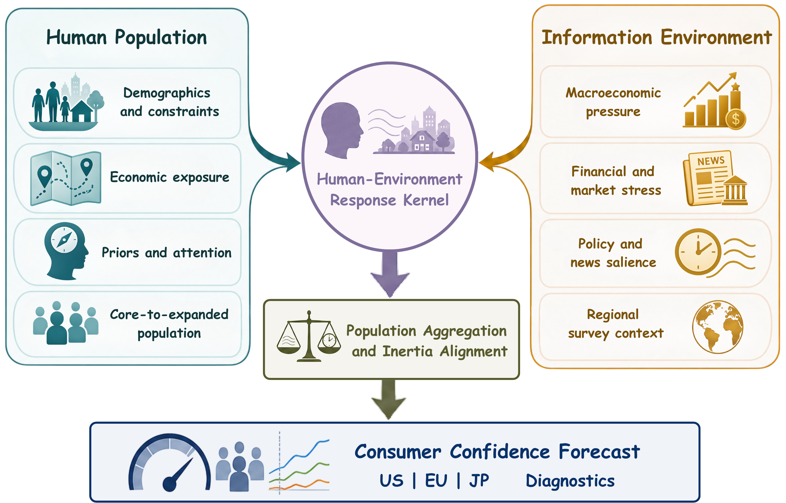

# ConsumerSim 

## Core Pipeline (JP / EU / US)

This directory contains a clean rewrite of the monthly ConsumerSim core pipeline. Its scope is limited to five stages:

1. Population sampling
2. Information environment construction (news and other indicators)
3. Core-sample prediction
4. Bayesian updating and population aggregation
5. Previous-month forecast debiasing

It intentionally excludes method comparisons, ablation studies, visualizations, websites, paper tables, downstream economic tasks, and downstream validation.

## 1. Pipeline

```text
Regional configuration (JP / EU / US)
          |
          +-- Population CSV or regional synthetic population
          |                    |
          |                    +--> Stratified core sample
          |
          +-- News JSONL ------+
          |                    +--> Point-in-time information environment
          +-- Indicator CSV ---+
                                       |
                                       v
                            Five-question core prediction
                                       |
                                       v
                         Group-level Dirichlet updating
                                       |
                                       v
                      Full-population expansion and aggregation
                                       |
                                       v
                         t-1 residual forecast debiasing
```

All information inputs are truncated at `--as-of`. Actual outcomes for the target month never enter the forecast. Debiasing may only read `predicted` and `actual` values from the immediately preceding calendar month (t-1).

## 2. Directory Structure

```text
pipeline/
├── assets/
│   └── consumersim-hnb-framework.png
├── consumer_pipeline/
│   ├── config.py          # Configuration, paths, and environment variables
│   ├── models.py          # Shared data structures
│   ├── regions.py         # JP / EU / US profiles and priors
│   ├── population.py      # Population loading, synthesis, and sampling
│   ├── information.py     # News and indicator environment
│   ├── prediction.py      # Local and optional API-compatible predictors
│   ├── bayesian.py        # Bayesian updating, expansion, and aggregation
│   ├── debias.py          # Strict t-1 residual correction
│   ├── output.py          # Standard output artifacts
│   ├── orchestrator.py    # Single pipeline orchestrator
│   └── cli.py             # Command-line entry point
├── configs/               # jp.yaml / eu.yaml / us.yaml
├── examples/              # Minimal synthetic examples; not real data
├── tests/                 # Core pipeline tests
└── outputs/               # Generated at runtime and ignored by Git
```

## 3. Quick Start

Run the following commands from this directory:

```powershell
python -m pip install -r requirements.txt
python -m consumer_pipeline.cli --config configs/us.yaml --month 2026-06 --as-of 2026-06-20
python -m consumer_pipeline.cli --config configs/jp.yaml --month 2026-06 --as-of 2026-06-20
python -m consumer_pipeline.cli --config configs/eu.yaml --month 2026-06 --as-of 2026-06-20
```

The default setting is `prediction.provider: local`, so the examples require no token and make no network requests. Example news, indicators, and history files demonstrate the input formats only and must not be used for research conclusions.

Each run writes:

```text
outputs/{region}/{YYYY-MM}/result.json
outputs/{region}/{YYYY-MM}/population_responses.csv
```

## 4. Input Contracts

### 4.1 Population

When `population.source_csv: null`, the pipeline creates a reproducible synthetic population using the regional distributions in `regions.py`. A production population CSV must contain:

```csv
consumer_id,age_group,income_group,education_group,location_group,weight
u000001,18-34,middle,tertiary,West,1.0
```

Recommended harmonized values:

- `age_group`: `18-34` / `35-54` / `55+`
- `income_group`: `low` / `middle` / `high`
- `education_group`: `secondary` / `tertiary`
- `location_group`: a region-specific value defined in `regions.py`
- `weight`: a non-negative survey weight; the default is 1.0

The core sample is stratified by `group_fields`, with its target size controlled by `core_ratio`.

### 4.2 News

News uses JSONL with one item per line:

```json
{"published_at":"2026-06-05","title":"Headline","sentiment":-0.2,"relevance":0.9}
```

- `sentiment` is clipped to `[-1, 1]`.
- `relevance` is a non-negative weight.
- Items published after `--as-of` are excluded automatically.
- Upstream collection and sentiment labeling are outside this directory; the pipeline consumes normalized records only.

### 4.3 Other Information Indicators

Indicators use CSV:

```csv
observed_at,name,z_score,weight
2026-06-03,inflation,-0.4,1.0
2026-06-10,employment,0.2,1.0
```

`z_score` must already be directionally aligned with consumer confidence by the upstream preparation step: positive values are optimistic and negative values are pessimistic. Values are clipped to `[-3, 3]`. Observations after `--as-of` are excluded automatically.

### 4.4 Previous-Month History

```csv
month,predicted,actual
2026-05,94.0,97.0
```

When forecasting 2026-06, the pipeline looks only for 2026-05. If that exact t-1 record is unavailable, no debiasing is applied. It never substitutes an older month or reads the 2026-06 actual outcome.

## 5. Prediction and Bayesian Aggregation

The five harmonized survey questions are:

- `current_finance`
- `durable_buying`
- `future_finance`
- `business_12m`
- `business_5y`

Each question returns `positive`, `neutral`, or `negative`.

The default local predictor starts from regional priors and applies the information-environment score plus small demographic adjustments. It samples with a fixed random seed and is intended for offline execution, integration testing, and interface validation.

Each demographic group and question uses a Dirichlet prior:

```text
alpha_prior(category) = regional_prior(category) * prior_strength
alpha_post(category)  = alpha_prior(category) + weighted_core_count(category)
posterior(category)   = alpha_post(category) / sum(alpha_post)
```

Groups without core observations fall back to the global core-sample posterior. Non-core consumers are sampled from their corresponding posterior. Each question is aggregated as:

```text
question_score = 100 + 100 * (weighted_positive - weighted_negative) / total_weight
raw_score      = mean(question_scores)
```

The harmonized internal score ranges from `[0, 200]`, with 100 as the neutral point. Official JP, EU, and US surveys use different scales. Mapping to a specific official index should be handled during data preparation rather than introduced as a region-specific downstream transformation in this core pipeline.

## 6. Previous-Month Debiasing

```text
residual_t-1 = actual_t-1 - predicted_t-1
adjustment_t = clip(weight * residual_t-1, +/-max_absolute_adjustment)
corrected_t  = clip(raw_score_t + adjustment_t, 0, 200)
```

`weight` shrinks the single-month error, while `max_absolute_adjustment` prevents an anomalous month from dominating the next forecast.

## 7. Optional API-Compatible Model

To use an external model for the five-question core prediction:

1. Set `prediction.provider` to `openai_compatible` in the regional config.
2. Replace `prediction.model` with the required model name.
3. Set the credential in the runtime environment:

```powershell
$env:CONSUMERSIM_MODEL_API_KEY = "your-token-at-runtime"
```

Configuration files store only the environment-variable name, never a token. Do not commit `.env` files, real tokens, authorization headers, logs containing credentials, or private endpoint credentials.

Users must obtain and configure their own API access or credentials for Google Trends, news services, and any other upstream data providers where authentication is required; this repository does not include or distribute shared tokens.

## 8. Tests

```powershell
python -m unittest discover -s tests -v
```

Tests cover all three regional configurations, point-in-time information filtering, Bayesian population expansion, strict t-1 debiasing, and credential validation.
